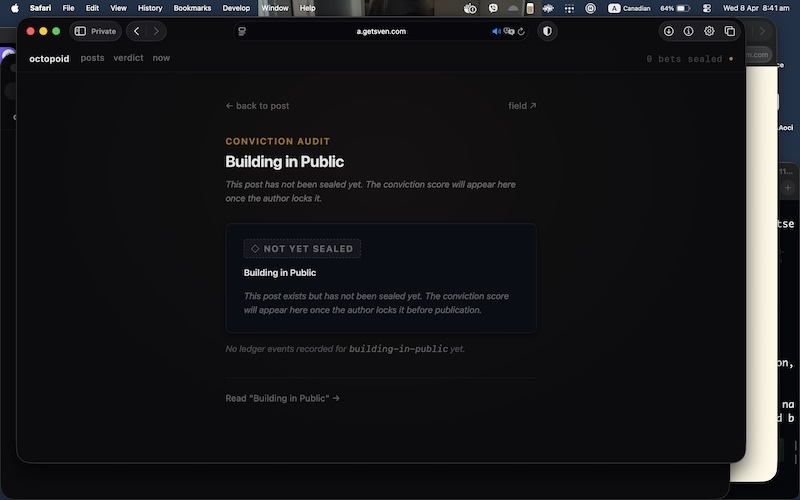
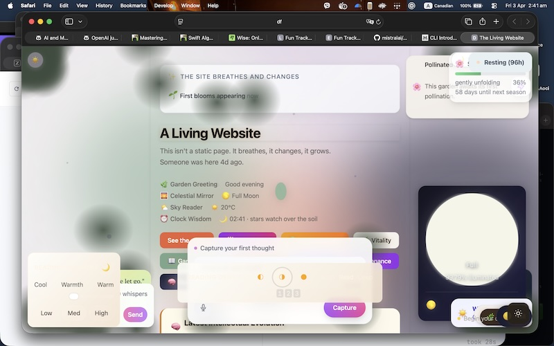
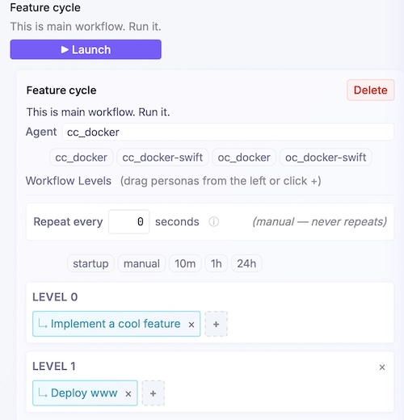
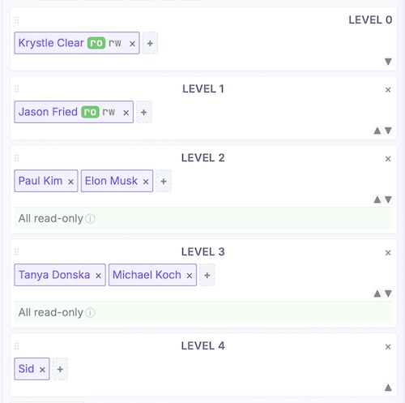
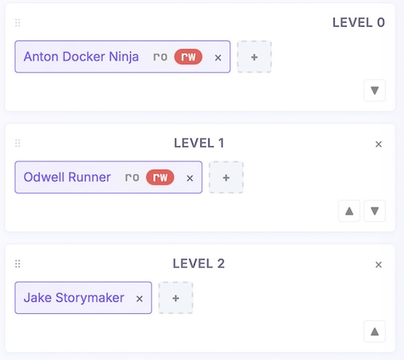

Make AI build this, not that

| this | not that |
|:---:|:---:|
|  |  |

This is very opinionted template that builds a website from scratch using [openloop](https://github.com/mimeCam/openloop) that holds claude-code on a 500-lines/commit leash.

## How to use

1. Install [openloop](https://github.com/mimeCam/openloop)

2. `fun-www-tpl` is configured to use claude-code, with [devbrain](https://devbrain.io/blog/mcp-devbrain) MCP for tech-related web searches. Use defaults or change mcps in `.mcp.json`.

3. Clone this repo & run `./start.sh` - openloop's flight control at [http://localhost:54321](http://localhost:54321) should open automatically.

4. Run `feature-step` workflow manually once to verify that it is working as expected. Open `openloop/workflows/feature-step.json5` and update `ask` field with your website idea.

## Workflows & Personas breakdown

| | |
|:---:|---|
|  | - main `feature-step` workflow executes 2 inner workflows: `code-it` then `deploy-it` |
|  | - Tap on personas to configure each to your liking. Also make sure to tap on persona's 'folder' icon to edit its personalized AGENTS.md - `Krystle` is VP and decides on `what gets built next`. If the previous commit is `wip` then continue past work - [Jason](https://world.hey.com/jason) is creative and spins `Krystle's` idea in a unique way - `Paul` and `Elon` are 2 analysts that ground [Jason's](https://world.hey.com/jason) thoughts to something that can be reasonably built - [Tanya](https://dnsk.work/blog) and `Mike` come up with implementation details from `Paul's` and `Elon's` specs. [Tanya](https://dnsk.work/blog) (UIX) enforces consistent and opinionated design across the project and `Mike` (CTO) decides on tech stack to use - `Sid` implements based on inputs from [Tanya](https://dnsk.work/blog) and `Mike`. |
|  | - `Anton` creates `deploy.sh` script that is supposed to host what `Sid` implemented - `Odwell` simply executes `deploy.sh` - `Jake` makes git commit (and pushes to remote if any) |

`feature-step` workflow is designed to run recursively in a loop and build features over time making changes ~500 lines per commits. After you verified that the workflow works as expected change `elapsed` from 0 to 1 kick start autopilot.

## Running this 24/7 in the cloud

Openloop can run under linux. Don't run this on your mac, don't buy a separate mac mini, leave that to claw fans.

Provider suggestion: Hetzner - BMW of cloud providers. Choose the cheapest $5/mo cost-optimized server type - it is more than enough.

## Examples

- Personal blog using anthropic inference [gh:fun-example-www-cca](https://github.com/mimeCam/fun-example-www-cca)
- Personal blog using z.ai inference [gh:fun-example-www-ccz](https://github.com/mimeCam/fun-example-www-ccz)
